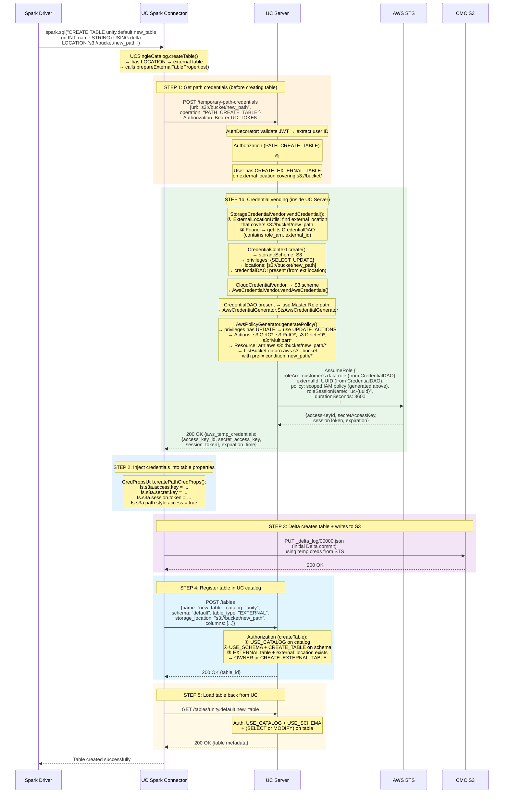
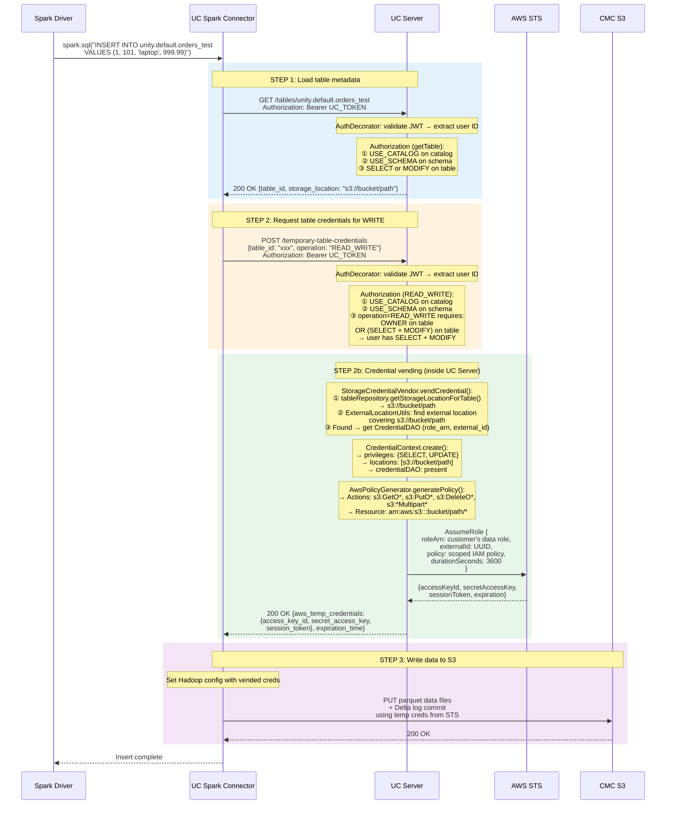
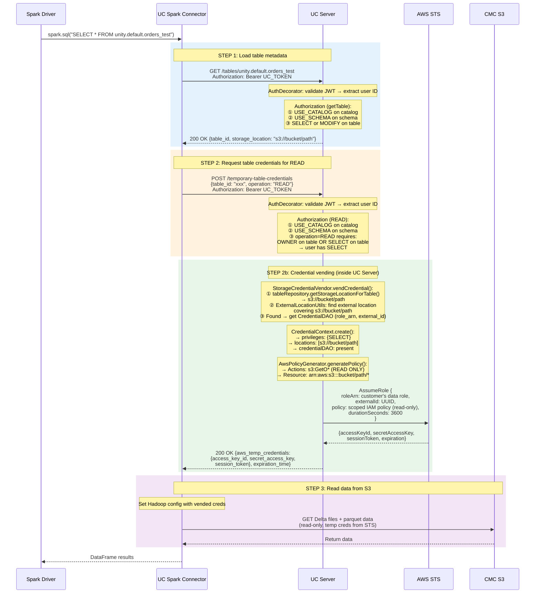
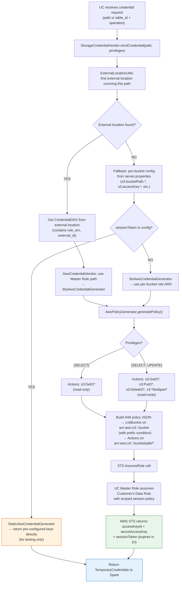
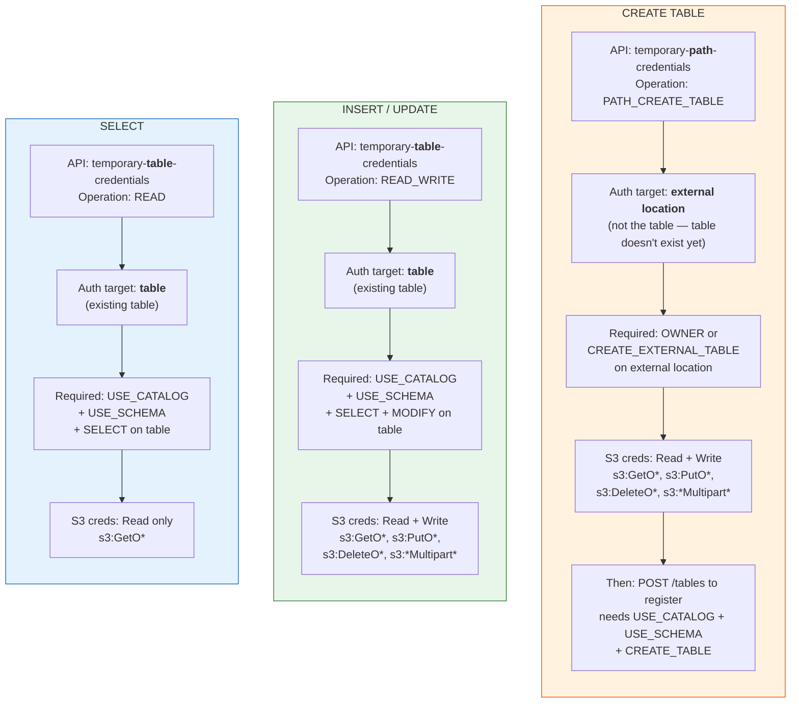

# Spark + Unity Catalog: Normal User Auth Flow

## Overview: Privileges Required per Operation

| Operation | Credential API | UC Privileges Required | S3 Actions Granted |
|-----------|---------------|----------------------|-------------------|
| **CREATE TABLE** | `temporary-path-credentials` (PATH_CREATE_TABLE) | External location: `OWNER` or `CREATE_EXTERNAL_TABLE` | `s3:GetO*`, `s3:PutO*`, `s3:DeleteO*`, `s3:*Multipart*` |
| **INSERT** | `temporary-table-credentials` (READ_WRITE) | `USE_CATALOG` + `USE_SCHEMA` + (`SELECT` + `MODIFY`) | `s3:GetO*`, `s3:PutO*`, `s3:DeleteO*`, `s3:*Multipart*` |
| **SELECT** | `temporary-table-credentials` (READ) | `USE_CATALOG` + `USE_SCHEMA` + `SELECT` | `s3:GetO*` |

---

## 1. CREATE TABLE flow (normal user)



## 2. INSERT flow (normal user)



## 3. SELECT flow (normal user)



## 4. Credential Vending: How UC gets temp S3 credentials

This is what happens inside `StorageCredentialVendor.vendCredential()` — the part that was missing from the flows above:



### The STS AssumeRole chain explained

```
UC Server has: Master IAM Role (configured in server.properties)
                    │
                    │  STS AssumeRole
                    │  + roleArn = customer's data role (from CredentialDAO)
                    │  + externalId = UUID (prevents confused deputy)
                    │  + policy = scoped session policy (generated above)
                    │  + duration = 1 hour
                    ▼
              AWS STS Service
                    │
                    │  Returns temporary credentials
                    │  (accessKeyId, secretAccessKey, sessionToken)
                    │  These creds can ONLY do what the scoped policy allows
                    │  on the specific bucket/path
                    ▼
              Spark uses these creds → S3 API calls
```

**Key point**: UC does NOT call S3 directly to get credentials. It calls **AWS STS** (Security Token Service) to assume a role. STS returns temporary credentials that are:
- Scoped to the specific S3 path (not the whole bucket)
- Scoped to specific actions (read-only for SELECT, read+write for INSERT/CREATE)
- Time-limited (1 hour)

## 5. Key Differences: CREATE vs INSERT vs SELECT



### Summary

| | CREATE TABLE | INSERT | SELECT |
|---|---|---|---|
| **Credential API** | `temporary-path-credentials` | `temporary-table-credentials` | `temporary-table-credentials` |
| **Operation type** | `PATH_CREATE_TABLE` | `READ_WRITE` | `READ` |
| **Auth target** | External location (path-based) | Table (resource-based) | Table (resource-based) |
| **Catalog privilege** | `USE_CATALOG` | `USE_CATALOG` | `USE_CATALOG` |
| **Schema privilege** | `USE_SCHEMA` + `CREATE_TABLE` | `USE_SCHEMA` | `USE_SCHEMA` |
| **Resource privilege** | `CREATE_EXTERNAL_TABLE` on ext. loc. | `SELECT` + `MODIFY` on table | `SELECT` on table |
| **S3 read** | `s3:GetO*` | `s3:GetO*` | `s3:GetO*` |
| **S3 write** | `s3:PutO*`, `s3:DeleteO*`, `s3:*Multipart*` | `s3:PutO*`, `s3:DeleteO*`, `s3:*Multipart*` | -- |
| **External location required?** | **YES** (for normal users) | No | No |
| **STS role assumed** | Customer's data role (from ext. loc. CredentialDAO) | Customer's data role (from ext. loc. CredentialDAO) | Customer's data role (from ext. loc. CredentialDAO) |
