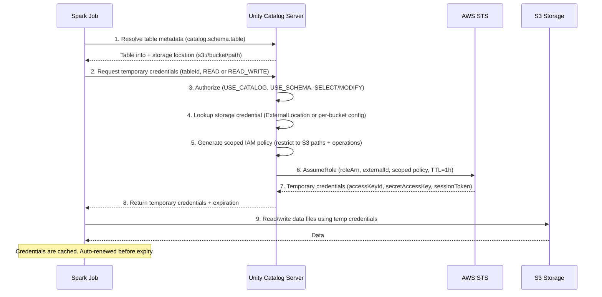
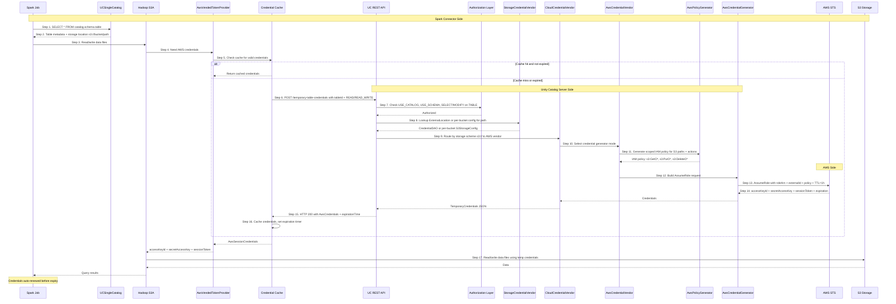
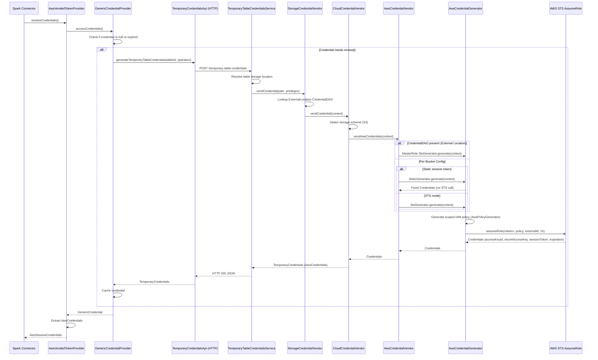
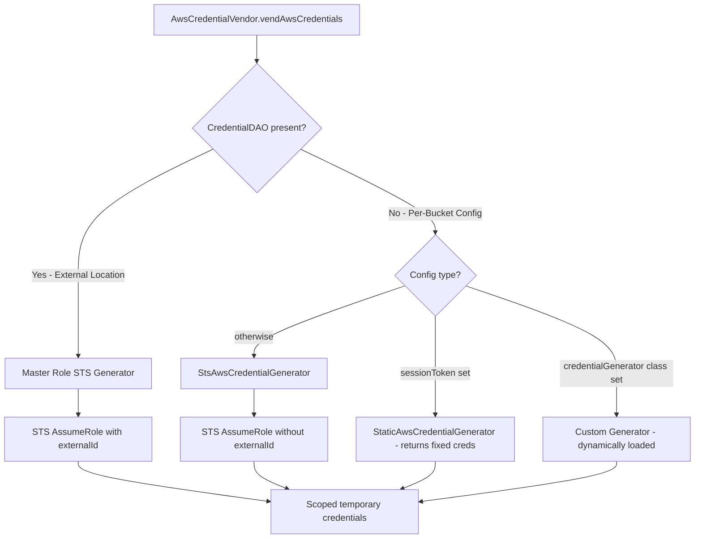

# Vending Credentials Flow for Spark Job

## High-Level Overview

## Detailed Architecture

## Overview

When a Spark job accesses a Unity Catalog table, it needs temporary cloud storage credentials to read/write the underlying data files. Unity Catalog vends these credentials through a multi-step flow involving the Spark connector and the UC server.

## Sequence Diagram

## Key Components

### Spark Connector Side

| Component | File | Role |
|---|---|---|
| `AwsVendedTokenProvider` | `connectors/spark/.../storage/AwsVendedTokenProvider.java` | Implements `AwsCredentialsProvider` for Hadoop S3A. Wraps vended credentials as `AwsSessionCredentials`. |
| `GenericCredentialProvider` | `connectors/spark/.../storage/GenericCredentialProvider.java` | Manages credential lifecycle (caching, renewal). Calls UC server API when credentials expire. |
| `TemporaryCredentialsApi` | Generated client | HTTP client that calls `POST /api/2.1/unity-catalog/temporary-table-credentials` on the UC server. |

### UC Server Side

| Component | File | Role |
|---|---|---|
| `TemporaryTableCredentialsService` | `server/.../service/TemporaryTableCredentialsService.java` | REST endpoint. Resolves table → storage location, enforces authorization, delegates to credential vendor. |
| `StorageCredentialVendor` | `server/.../service/credential/StorageCredentialVendor.java` | Looks up `CredentialDAO` from external locations, builds `CredentialContext`, delegates to cloud vendor. |
| `CloudCredentialVendor` | `server/.../service/credential/CloudCredentialVendor.java` | Routes to AWS/Azure/GCP vendor based on storage scheme (`s3://`, `abfss://`, `gs://`). |
| `AwsCredentialVendor` | `server/.../service/credential/aws/AwsCredentialVendor.java` | Selects credential generator based on config mode (external location vs per-bucket). |
| `AwsCredentialGenerator` | `server/.../service/credential/aws/AwsCredentialGenerator.java` | Calls AWS STS `AssumeRole` with a scoped-down IAM policy. Returns temporary `accessKeyId`, `secretAccessKey`, `sessionToken`. |
| `AwsPolicyGenerator` | `server/.../service/credential/aws/AwsPolicyGenerator.java` | Generates a scoped IAM policy restricting access to specific S3 paths and operations (SELECT → `s3:GetO*`, UPDATE → `s3:PutO*`, `s3:DeleteO*`). |

## Credential Generation Modes

### Mode 1: External Location Credentials (CredentialDAO)

The UC master IAM role assumes the customer's storage IAM role via STS:

- **roleArn**: from `CredentialDAO` → `AwsIamRoleResponse.roleArn`
- **externalId**: from `CredentialDAO` → `AwsIamRoleResponse.externalId` (prevents confused deputy)
- **policy**: scoped-down to specific S3 paths and operations
- **duration**: 1 hour

### Mode 2: Per-Bucket Config (`server.properties`)

Uses `s3.bucketPath.*`, `s3.accessKey.*`, `s3.secretKey.*` etc.:

- **Static**: If `sessionToken` is set, returns it directly (no STS call). For testing only.
- **Custom**: If `credentialGenerator` is set, loads the class dynamically.
- **STS**: Otherwise, uses the configured access/secret key (or default credentials) to call STS AssumeRole.

## Credential Caching & Renewal

The Spark connector caches credentials to avoid excessive API calls:

1. `GenericCredentialProvider` holds a `volatile GenericCredential`
2. On each `accessCredentials()` call, checks if credential is null or near expiry
3. Renewal lead time is configurable via `fs.unitycatalog.credential.renewalLeadTime` (default: pre-expiry buffer)
4. A global `Cache<String, GenericCredential>` is shared across providers (max 1024 entries)

## Non-AWS S3 (e.g., CMC S3) Considerations

The default STS flow assumes AWS infrastructure (`sts.amazonaws.com`, `arn:aws:s3:::` ARNs). For S3-compatible storage:

- **Option 1**: Use `StaticAwsCredentialGenerator` with a pre-set session token (bypasses STS)
- **Option 2**: Implement a custom `AwsCredentialGenerator` and set it via `s3.credentialGenerator.<bucket>` in `server.properties`
- **Option 3**: Skip credential vending entirely and configure static S3 keys directly in Spark/Hadoop config
